# Praktikum 1 - 3: PHP Framework (CodeIgniter 4) & MySQL

<p align="center">
    
    
    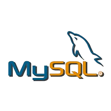
</p>


Dokumentasi ini berisi rangkuman materi dan latihan dalam **Praktikum 1-3** dari mata kuliah **Pemorograman Web 2**.  
Setiap praktikum membahas berbagai aspek penggunaan **PHP Framework CodeIgniter 4**, mulai dari dasar hingga konsep lanjutan seperti **CRUD, View Layout, dan View Cell**.

Praktikum ini bertujuan untuk memberikan pemahaman mendalam tentang **pengembangan aplikasi web berbasis CodeIgniter 4**, termasuk konfigurasi awal, struktur proyek, serta implementasi fitur-fitur esensial dalam sebuah aplikasi web.

---

## 📖 Daftar Praktikum

1. [Praktikum 1: PHP Framework CodeIgniter 4](#praktikum-1-php-framework-codeigniter-4)
2. [Praktikum 2: Framework Lanjutan (CRUD)](#praktikum-2-framework-lanjutan-crud)
3. [Praktikum 3: View Layout dan View Cell](#praktikum-3-view-layout-dan-view-cell)

---

## 👤 Profil Mahasiswa

| Variable           | Isi                         |
| ------------------ | --------------------------- |
| **Nama**           | Ahmad Ridho Septian         |
| **NIM**            | 312310447                   |
| **Kelas**          | TI.23.A.5                   |
| **Mata Kuliah**    | Pemrograman Web 2           |
| **Dosen Pengampu** | Agung Nugroho S.kom., M.kom |

---

# Praktikum: 1 PHP Framework CodeIgniter 4

## Tujuan

1. Memahami konsep dasar Framework.
2. Memahami konsep dasar MVC.
3. Membuat program sederhana menggunakan Framework CodeIgniter 4.

## Persiapan

Sebelum menggunakan CodeIgniter 4, aktifkan ekstensi PHP berikut di `php.ini`:

**Screenshot:**
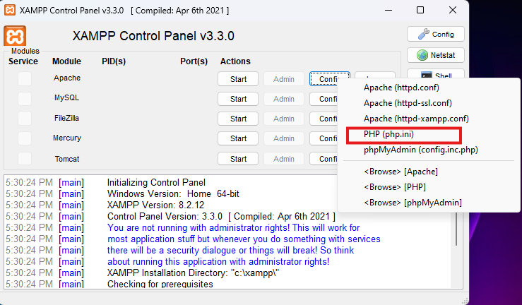

setelah itu aktifkan berikut ini:

- `php-json`
- `php-mysqlnd`
- `php-xml`
- `php-intl`
- `libcurl` (opsional)

### Langkah-langkah:

1. Buka **XAMPP Control Panel**
2. Klik `Config` -> `PHP.ini`
3. Cari ekstensi yang disebutkan di atas dan hilangkan tanda `;` (titik koma)
4. Simpan perubahan dan restart Apache

**Screenshot:**
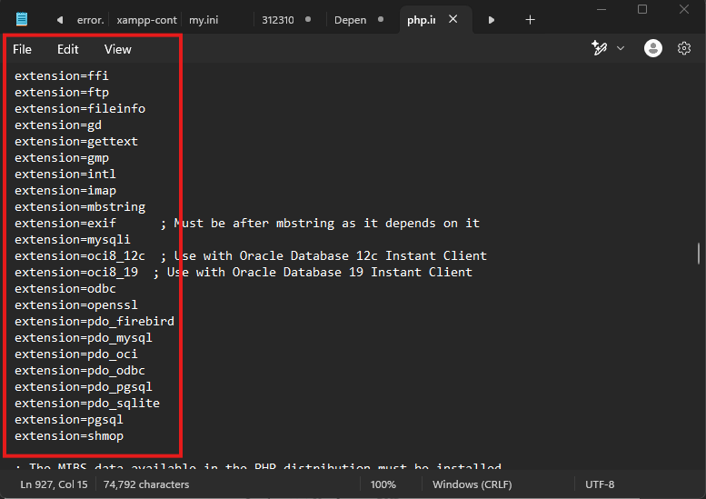

---

## Instalasi CodeIgniter 4 (Manual)

1. Unduh CodeIgniter dari [codeigniter.com](https://codeigniter.com/download)
2. Ekstrak ke `htdocs/lab11_ci`
3. Ubah nama folder menjadi `ci4`
4. Buka di browser: `http://localhost/lab11_ci/ci4/public/`

**Screenshot:**
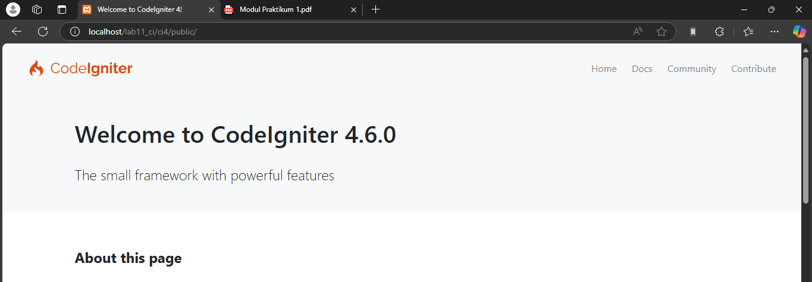

---

## Menjalankan CLI CodeIgniter

1. Buka **Command Prompt**
2. Arahkan ke direktori proyek: `cd xampp/htdocs/lab11_ci/ci4/`
3. Jalankan perintah berikut:
   ```sh
   php spark
   ```

**Screenshot:**
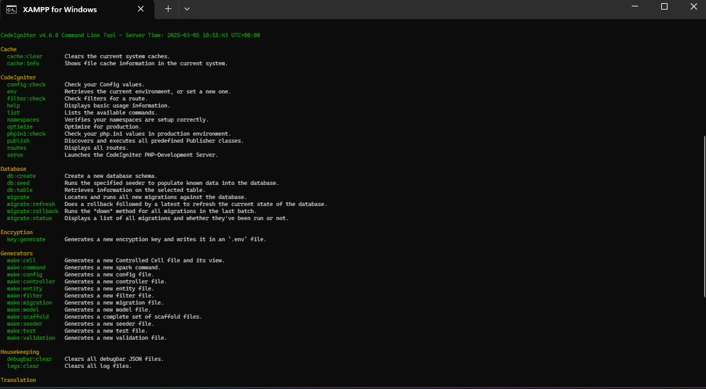

---

## Mengaktifkan Mode Debugging

**Screenshot:**
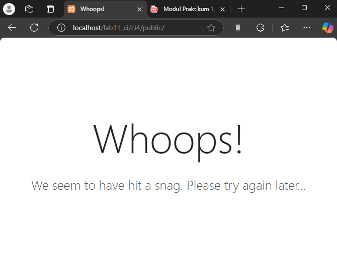

1. Ubah nama file `.env.example` menjadi `.env`
2. Edit file `.env`, ubah nilai:
   ```sh
   CI_ENVIRONMENT = development
   ```
3. Simpan perubahan dan restart Apache

**Screenshot:**
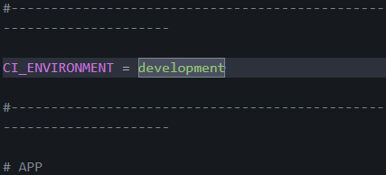

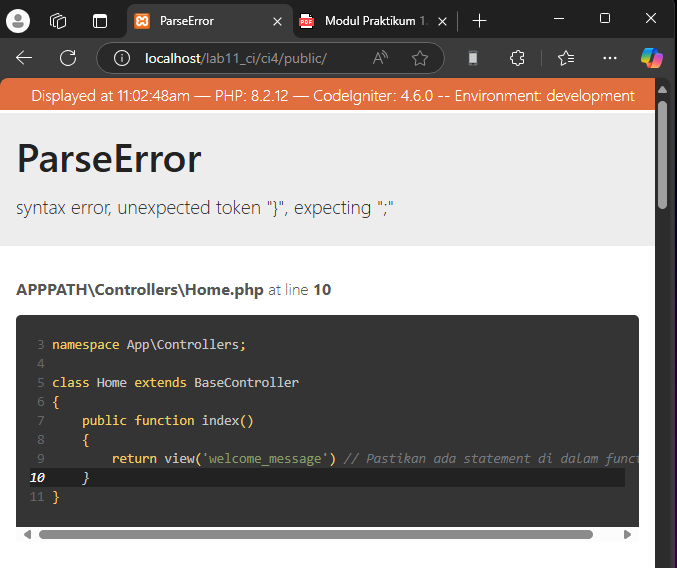

---

## Struktur Direktori CodeIgniter 4

Beberapa folder penting dalam CodeIgniter:

- `app/` - Berisi kode aplikasi (Controller, Model, View)
- `public/` - Berisi file publik seperti CSS, JavaScript, dll.
- `tests/` - Berisi kode untuk pengujian dengan PHPUnit
- `vendor/` - Berisi library yang digunakan CodeIgniter

**Screenshot:**
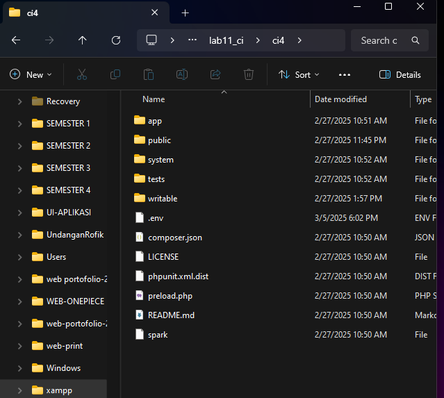

---

## Memahami Konsep MVC

1. **Model** - Bertanggung jawab atas pengelolaan data
2. **View** - Menampilkan tampilan ke pengguna
3. **Controller** - Menghubungkan Model dan View

---

## Routing dan Controller

1. Buka file `app/Config/Routes.php`
2. Tambahkan route baru:
   ```php
   $routes->get('/about', 'Page::about');
   $routes->get('/contact', 'Page::contact');
   $routes->get('/faqs', 'Page::faqs');
   ```
3. Jalankan perintah berikut untuk melihat daftar route:
   ```sh
   php spark routes
   ```

**Screenshot CLI & Error Page :**
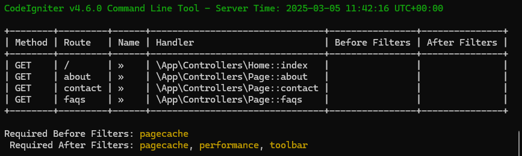

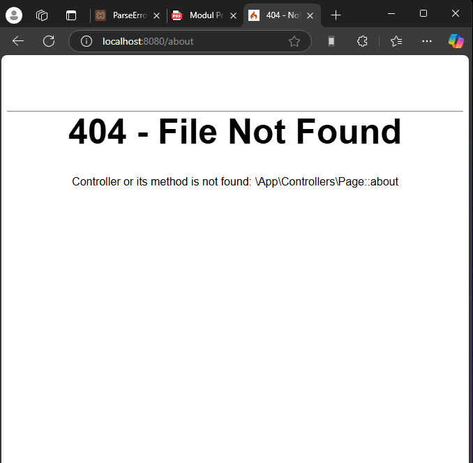

---

## Membuat Controller

1. Buat file baru `app/Controllers/Page.php`
2. Tambahkan kode berikut:

   ```php
   namespace App\Controllers;

   <?php
   namespace App\Controllers;
   class Page extends BaseController {
    public function about() { echo "Ini halaman About"; }
    public function contact() { echo "Ini halaman Contact"; }
    public function faqs() { echo "Ini halaman FAQ"; }
   }
   ```

3. Akses `http://localhost:8080/about`

**Screenshot:**
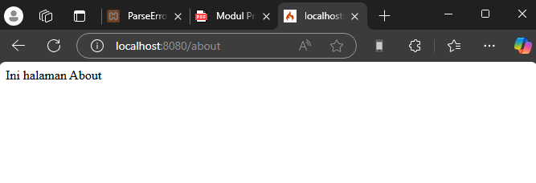

---

## Membuat View

1. Buat file baru `app/Views/about.php`
2. Tambahkan kode berikut:
   ```php
   <!DOCTYPE html>
   <html>
   <head>
       <title><?= $title; ?></title>
   </head>
   <body>
       <h1><?= $title; ?></h1>
       <p><?= $content; ?></p>
   </body>
   </html>
   ```
3. Edit `Page.php` untuk menggunakan view:
   ```php
   public function about() {
       return view('about', [
           'title' => 'Halaman About',
           'content' => 'Ini adalah halaman about.'
       ]);
   }
   ```

**Screenshot:**
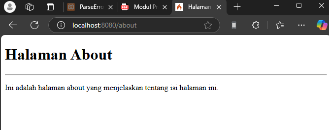

---

## Membuat Layout Web dengan CSS

1. Buat file `public/style.css` untuk menyimpan CSS
2. Buat folder `app/Views/template/` dan buat `header.php` serta `footer.php`
3. Ubah `about.php` menjadi:
   ```php
   <?= $this->include('template/header'); ?>
   <h1><?= $title; ?></h1>
   <p><?= $content; ?></p>
   <?= $this->include('template/footer'); ?>
   ```

## Pertanyaan dan Tugas

Lengkapi kode program untuk menu lainnya yang ada pada Controller Page, sehingga semua
link pada navigasi header dapat menampilkan tampilan dengan layout yang sama.

`Controllers/Page.php`

```<?php
namespace App\Controllers;

class Page extends BaseController {
    public function home()
    {
        return view('home', [
            'title' => 'Beranda',
            'content' => 'Selamat datang di halaman utama website kami.
            Di sini Anda dapat menemukan informasi terbaru dan menarik.'
        ]);
    }

    public function about()
    {
        return view('about', [
            'title' => 'Halaman About',
            'content' => 'Kami adalah sebuah institusi yang berkomitmen
            untuk memberikan pelayanan dan informasi terbaik.
            Visi kami adalah memberdayakan pengetahuan dan pengembangan.'
        ]);
    }

    public function artikel()
    {
        return view('artikel', [
            'title' => 'Artikel',
            'content' => 'Kumpulan artikel terbaru dan informatif
            yang membahas berbagai topik menarik dan bermanfaat.'
        ]);
    }

    public function contact()
    {
        return view('contact', [
            'title' => 'Hubungi Kami',
            'content' => 'Anda dapat menghubungi kami melalui
            informasi kontak di bawah ini.',
            'kontak' => [
                'email' => 'info@universitaspelitabangsa.ac.id',
                'telepon' => '+62 (021) 1234 5678',
                'alamat' => 'Jl. Raya Cikarang, Bekasi, Jawa Barat'
            ]
        ]);
    }

    public function faqs()
    {
        return view('faqs', [
            'title' => 'Pertanyaan Umum',
            'faqs' => [
                [
                    'question' => 'Apa itu Universitas Pelita Bangsa?',
                    'answer' => 'Universitas Pelita Bangsa adalah perguruan tinggi
                    yang fokus pada pengembangan kualitas pendidikan dan
                    pemberdayaan potensi mahasiswa.'
                ],
                [
                    'question' => 'Jurusan apa saja yang tersedia?',
                    'answer' => 'Kami menawarkan berbagai program studi
                    di bidang teknologi, bisnis, dan humaniora.'
                ]
            ]
        ]);
    }
}
```

**Screenshot halaman Home:**
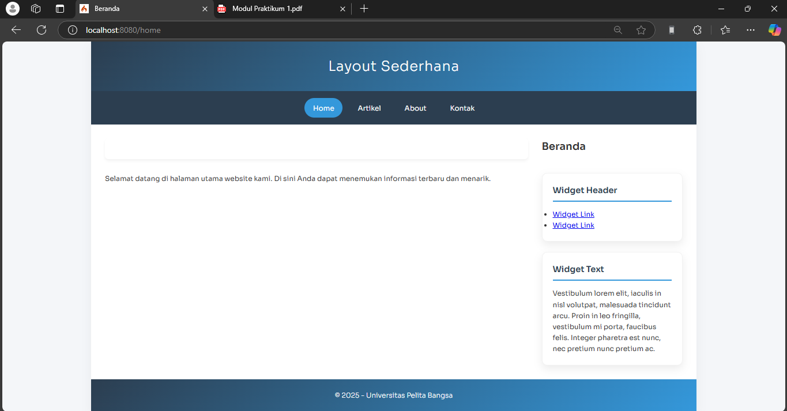
**Screenshot halaman Artikel:**
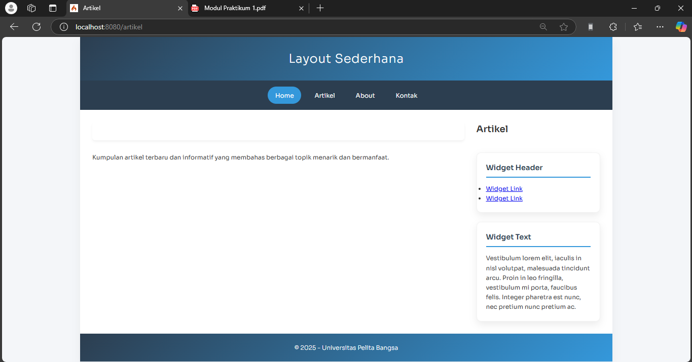
**Screenshot halaman Home:**
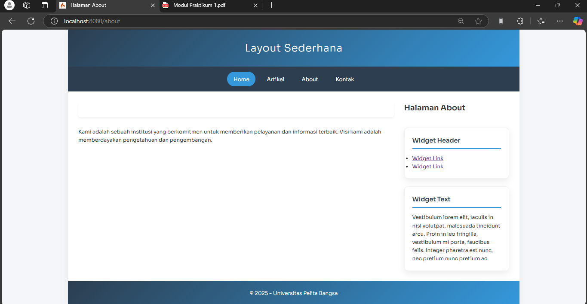
**Screenshot halaman Home:**
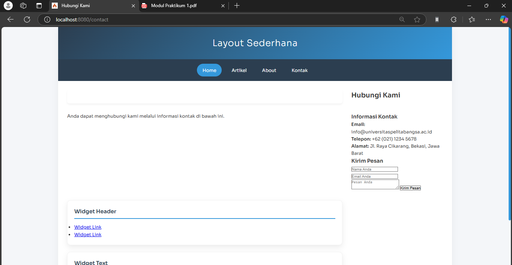

# Praktikum 2: Framework Lanjutan (CRUD)

## Tujuan

1. Mahasiswa mampu memahami konsep dasar Model.
2. Mahasiswa mampu memahami konsep dasar CRUD.
3. Mahasiswa mampu membuat program sederhana menggunakan Framework CodeIgniter4.

---

## Langkah-langkah Praktikum

### 1. Membuat Database

Buka MySQL dan jalankan perintah berikut:

```sql
CREATE DATABASE lab_ci4;
```

Kemudian buat tabel `artikel`:

```sql
CREATE TABLE artikel (
  id INT(11) AUTO_INCREMENT,
  judul VARCHAR(200) NOT NULL,
  isi TEXT,
  gambar VARCHAR(200),
  status TINYINT(1) DEFAULT 0,
  slug VARCHAR(200),
  PRIMARY KEY(id)
);
```

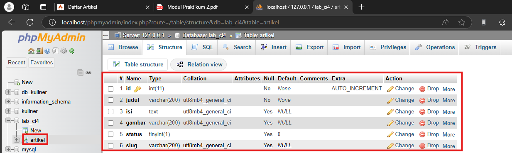

### 2. Konfigurasi Database

Ubah file `.env` untuk menghubungkan aplikasi dengan database.

```env
database.default.hostname = localhost
database.default.database = lab_ci4
database.default.username = root
database.default.password =
database.default.DBDriver = MySQLi
```

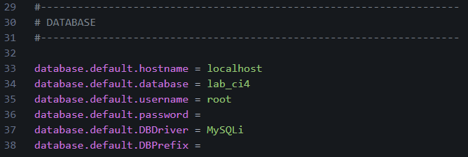

---

## 3. Membuat Model

Buat file `app/Models/ArtikelModel.php`:

```php
<?php
namespace App\Models;
use CodeIgniter\Model;
class ArtikelModel extends Model {
    protected $table = 'artikel';
    protected $primaryKey = 'id';
    protected $useAutoIncrement = true;
    protected $allowedFields = ['judul', 'isi', 'status', 'slug', 'gambar'];
}
```

---

## 4. Membuat Controller

Buat file `app/Controllers/Artikel.php`:

```php
<?php
namespace App\Controllers;
use App\Models\ArtikelModel;
class Artikel extends BaseController {
    public function index() {
        $title = 'Daftar Artikel';
        $model = new ArtikelModel();
        $artikel = $model->findAll();
        return view('artikel/index', compact('artikel', 'title'));
    }
}
```

---

## 5. Membuat View

Buat folder `app/Views/artikel/` dan file `index.php`:

```php
<?= $this->include('template/header'); ?>
<?php if($artikel): foreach($artikel as $row): ?>
<article class="entry">
    <h2><a href="<?= base_url('/artikel/' . $row['slug']); ?>"><?= $row['judul']; ?></a></h2>
    " alt="<?= $row['judul']; ?>">
    <p><?= substr($row['isi'], 0, 200); ?></p>
</article>
<hr class="divider" />
<?php endforeach; else: ?>
<article class="entry">
    <h2>Belum ada data.</h2>
</article>
<?php endif; ?>
<?= $this->include('template/footer'); ?>
```

**Screenshot Tampilan Artikel:**  
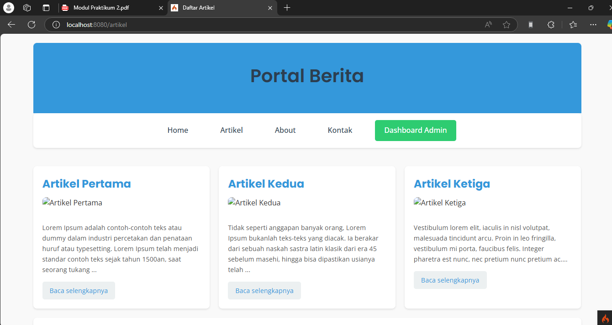

---

## 6. Menampilkan Detail Artikel

Tambahkan metode `view()` dalam `Artikel.php`:

```php
public function view($slug) {
    $model = new ArtikelModel();
    $artikel = $model->where(['slug' => $slug])->first();
    if (!$artikel) {
        throw PageNotFoundException::forPageNotFound();
    }
    $title = $artikel['judul'];
    return view('artikel/detail', compact('artikel', 'title'));
}
```

Buat file `app/Views/artikel/detail.php`:

```php
<?= $this->include('template/header'); ?>
<article class="entry">
    <h2><?= $artikel['judul']; ?></h2>
    " alt="<?= $artikel['judul']; ?>">
    <p><?= $artikel['isi']; ?></p>
</article>
<?= $this->include('template/footer'); ?>
```

**Screenshot Tampilan Detail Artikel:**  
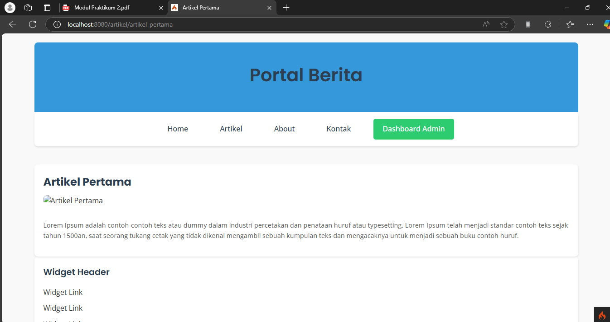

---

## 7. Membuat Menu Admin (CRUD)

Tambahkan metode `admin_index()` dalam `Artikel.php`:

```php
public function admin_index() {
    $title = 'Daftar Artikel';
    $model = new ArtikelModel();
    $artikel = $model->findAll();
    return view('artikel/admin_index', compact('artikel', 'title'));
}
```

Buat file `app/Views/artikel/admin_index.php`:

```php
<?= $this->include('template/admin_header'); ?>
<table class="table">
    <thead>
        <tr>
            <th>ID</th>
            <th>Judul</th>
            <th>Status</th>
            <th>Aksi</th>
        </tr>
    </thead>
    <tbody>
    <?php foreach($artikel as $row): ?>
    <tr>
        <td><?= $row['id']; ?></td>
        <td><?= $row['judul']; ?></td>
        <td><?= $row['status']; ?></td>
        <td>
            <a href="<?= base_url('/admin/artikel/edit/' . $row['id']); ?>">Ubah</a>
            <a href="<?= base_url('/admin/artikel/delete/' . $row['id']); ?>">Hapus</a>
        </td>
    </tr>
    <?php endforeach; ?>
    </tbody>
</table>
<?= $this->include('template/admin_footer'); ?>
```

**Screenshot Tampilan Admin Index:**  
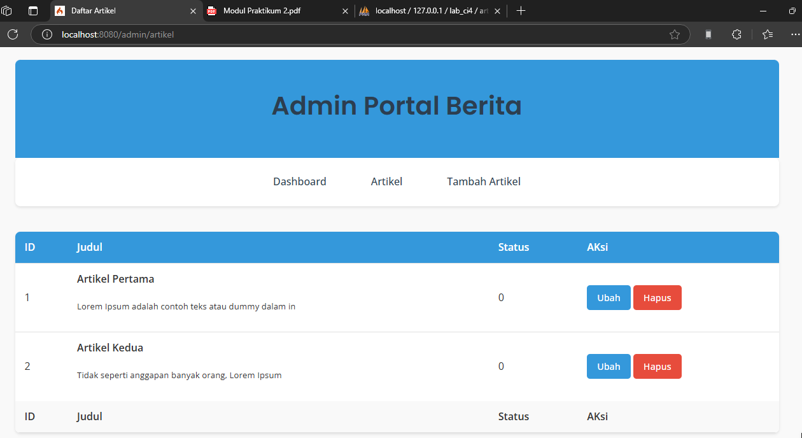

---

## 8. Menambahkan Data Artikel

Tambahkan metode `add()` dalam `Artikel.php`:

```php
public function add() {
    $artikel = new ArtikelModel();
    $artikel->insert([
        'judul' => $this->request->getPost('judul'),
        'isi' => $this->request->getPost('isi'),
        'slug' => url_title($this->request->getPost('judul'))
    ]);
    return redirect('admin/artikel');
}
```

Buat file `app/Views/artikel/form_add.php`:

```php
<?= $this->include('template/admin_header'); ?>
<form action="" method="post">
    <input type="text" name="judul">
    <textarea name="isi"></textarea>
    <input type="submit" value="Kirim">
</form>
<?= $this->include('template/admin_footer'); ?>
```

**Screenshot Form Tambah Artikel:**  
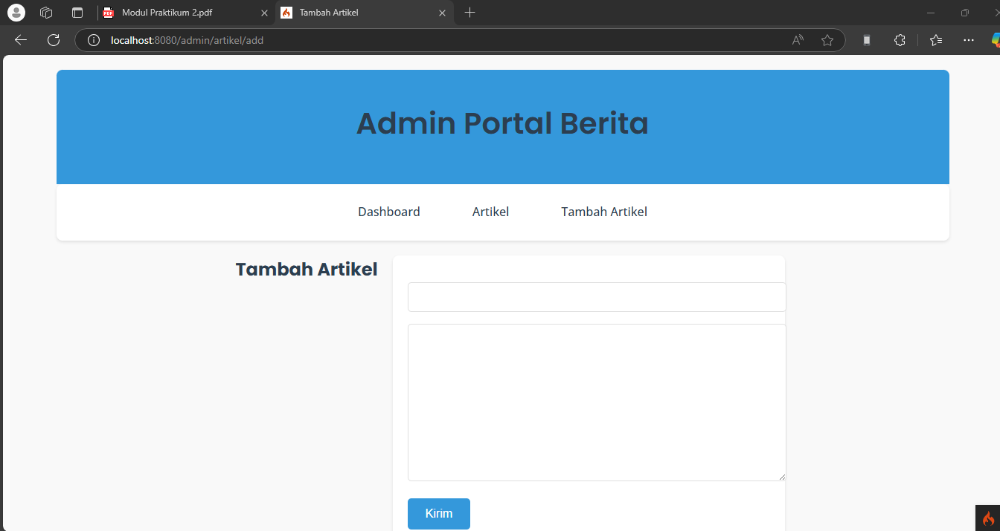

---

## 9. Mengubah Data Artikel

Tambahkan fungsi/method baru pada Controller Artikel dengan nama `edit()`.

```
public function edit($id)
    {
        $artikel = new ArtikelModel();

        // validasi data.
        $validation =  \Config\Services::validation();
        $validation->setRules(['judul' => 'required']);
        $isDataValid = $validation->withRequest($this->request)->run();

        if ($isDataValid)
        {
            $artikel->update($id, [
                'judul' => $this->request->getPost('judul'),
                'isi' => $this->request->getPost('isi'),
            ]);
            return redirect('admin/artikel');
        }

        // ambil data lama
        $data = $artikel->where('id', $id)->first();
        $title = "Edit Artikel";
        return view('artikel/form_edit', compact('title', 'data'));
    }
```

Kemudian buat view untuk form tambah dengan nama `form_edit.php`

```
<?= $this->include('template/admin_header'); ?>

<h2><?= $title; ?></h2>
<form action="" method="post">
  <p>
    <input type="text" name="judul" value="<?= $data['judul'];?>">
  </p>
  <p>
    <textarea name="isi" cols="50" rows="10"><?=
$data['isi'];?></textarea>
  </p>
  <p><input type="submit" value="Kirim" class="btn btn-large"></p>
</form>

<?= $this->include('template/admin_footer'); ?>
```

## 10. Menghapus Data

Tambahkan metode `delete()` dalam `Artikel.php`:

```php
public function delete($id) {
    $artikel = new ArtikelModel();
    $artikel->delete($id);
    return redirect('admin/artikel');
}
```

---

# Praktikum 3: View Layout dan View Cell

## Tujuan

Setelah menyelesaikan praktikum ini, mahasiswa diharapkan dapat:

1. Memahami konsep **View Layout** di CodeIgniter 4.
2. Menggunakan **View Layout** untuk membuat template tampilan.
3. Memahami dan mengimplementasikan **View Cell** dalam CodeIgniter 4.
4. Menggunakan **View Cell** untuk memanggil komponen UI secara modular.

---

## Pertanyaan

Apa manfaat utama dari penggunaan View Layout dalam pengembangan aplikasi?

## Manfaat Utama dari View Layout

**View Layout** digunakan dalam pengembangan aplikasi untuk:

- **Menyusun Template Secara Konsisten**: Menggunakan satu layout untuk banyak halaman sehingga lebih mudah dalam pemeliharaan.
- **Meningkatkan Efisiensi Koding**: Menghindari pengulangan kode dengan menyusun bagian seperti header, footer, dan sidebar dalam satu file.
- **Mempermudah Perubahan Tampilan**: Cukup mengubah satu file layout untuk memperbarui tampilan seluruh aplikasi.
- **Memisahkan Logika dari Tampilan**: Memudahkan pengembangan dan debugging karena struktur kode lebih rapi.

---

## Pertanyaan

Jelaskan perbedaan antara View Cell dan View biasa.

## Perbedaan View Layout dan View Cell

| Fitur             | View Layout                                             | View Cell                                                     |
| ----------------- | ------------------------------------------------------- | ------------------------------------------------------------- |
| Fungsi            | Template utama yang mengatur struktur tampilan          | Komponen modular yang bisa dipanggil dalam tampilan           |
| Fleksibilitas     | Digunakan untuk halaman penuh                           | Bisa digunakan dalam bagian kecil seperti sidebar atau widget |
| Pemakaian         | `extend()` dan `renderSection()`                        | `view_cell()`                                                 |
| Contoh Penggunaan | Layout utama website dengan header, footer, dan sidebar | Daftar artikel terbaru, widget pencarian, dll                 |

---

## Langkah-langkah Praktikum

### 1. Menyesuaikan Data dengan Praktikum Sebelumnya

Tambahkan **field tanggal dan kategori** pada database untuk mengambil data artikel terbaru berdasarkan kategori. Jalankan perintah berikut di MySQL:

```sql
ALTER TABLE artikel ADD COLUMN created_at TIMESTAMP DEFAULT CURRENT_TIMESTAMP;
ALTER TABLE artikel ADD COLUMN kategori VARCHAR(100);
```

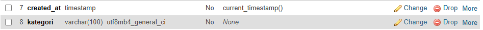
Dengan menambahkan `kategori`, kita bisa mengelompokkan artikel berdasarkan topiknya.

---

## 2. Membuat Layout Utama

Buat folder `layout` di dalam `app/Views/` dan buat file `main.php` dengan kode berikut:

```php
<!DOCTYPE html>
<html lang="en">
<head>
    <meta charset="UTF-8">
    <title><?= $title ?? 'My Website' ?></title>
    <link rel="stylesheet" href="<?= base_url('/style.css');?>">
</head>
<body>
    <div id="container">
        <header>
            <h1>Layout Sederhana</h1>
        </header>
        <nav>
            <a href="<?= base_url('/'); ?>" class="active">Home</a>
            <a href="<?= base_url('/artikel'); ?>">Artikel</a>
            <a href="<?= base_url('/about'); ?>">About</a>
            <a href="<?= base_url('/contact'); ?>">Kontak</a>
            <a href="<?= base_url('/admin/artikel'); ?>">Dashboard Admin</a>
        </nav>
        <section id="wrapper">
            <section id="main">
                <?= $this->renderSection('content') ?>
            </section>
            <aside id="sidebar">
                <?= view_cell('App\\Cells\\ArtikelTerkini::render', ['kategori' => $_GET['kategori'] ?? null]) ?>
                <div class="widget-box">
                    <h3 class="title">Widget Header</h3>
                    <ul>
                        <li><a href="#">Widget Link</a></li>
                        <li><a href="#">Widget Link</a></li>
                    </ul>
                </div>
                <div class="widget-box">
                    <h3 class="title">Widget Text</h3>
                    <p>Vestibulum lorem elit, iaculis in nisl volutpat,
                        malesuada tincidunt arcu. Proin in leo fringilla,
                        vestibulum mi porta,
                        faucibus felis. Integer pharetra est nunc, nec pretium
                        nunc pretium ac.</p>
                </div>
            </aside>
        </section>
        <footer>
            <p>&copy; 2024 - Universitas Pelita Bangsa</p>
        </footer>
    </div>
</body>
</html>
```

---

## 3. Modifikasi File View Cell untuk Menampilkan Kategori

### **`app/Cells/ArtikelTerkini.php`**

```php
<?php
namespace App\Cells;
use App\Models\ArtikelModel;

class ArtikelTerkini {
    public function render($kategori = null) {
        $model = new ArtikelModel();

        // Ambil data berdasarkan kategori jika ada
        if ($kategori) {
            $artikel = $model->where('kategori', $kategori)
                             ->orderBy('created_at', 'DESC')
                             ->limit(5)
                             ->findAll();
        } else {
            $artikel = $model->orderBy('created_at', 'DESC')
                             ->limit(5)
                             ->findAll();
        }

        return view('components/artikel_terkini', ['artikel' => $artikel, 'kategori' => $kategori]);
    }
}
```

### **Edit `app/Views/components/artikel_terkini.php`**

```php
<h3>Artikel Terkini<?= $kategori ? ' - ' . $kategori : ''; ?></h3>
<ul>
  <?php if (!empty($artikel)): ?>
      <?php foreach ($artikel as $row): ?>
      <li>
        <a href="<?= base_url('/artikel/' . $row['slug']) ?>">
          <?= $row['judul'] ?>
        </a>
        <br>
        <small>Diposting pada: <?= date('d M Y H:i', strtotime($row['created_at'])); ?></small>
        <br>
        <small>Kategori: <?= $row['kategori']; ?></small>
      </li>
      <?php endforeach; ?>
  <?php else: ?>
      <p>Tidak ada artikel dalam kategori ini.</p>
  <?php endif; ?>
</ul>
```

## Pertanyaan

Ubah View Cell agar hanya menampilkan post dengan kategori tertentu.
**screenshot tampilan artikel terkini berdasarkan kategori**.
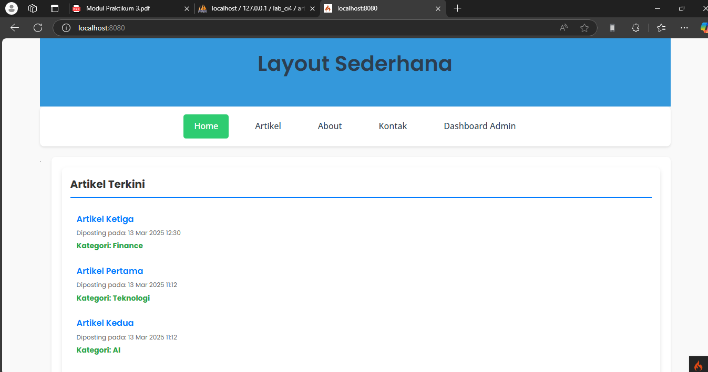

---
